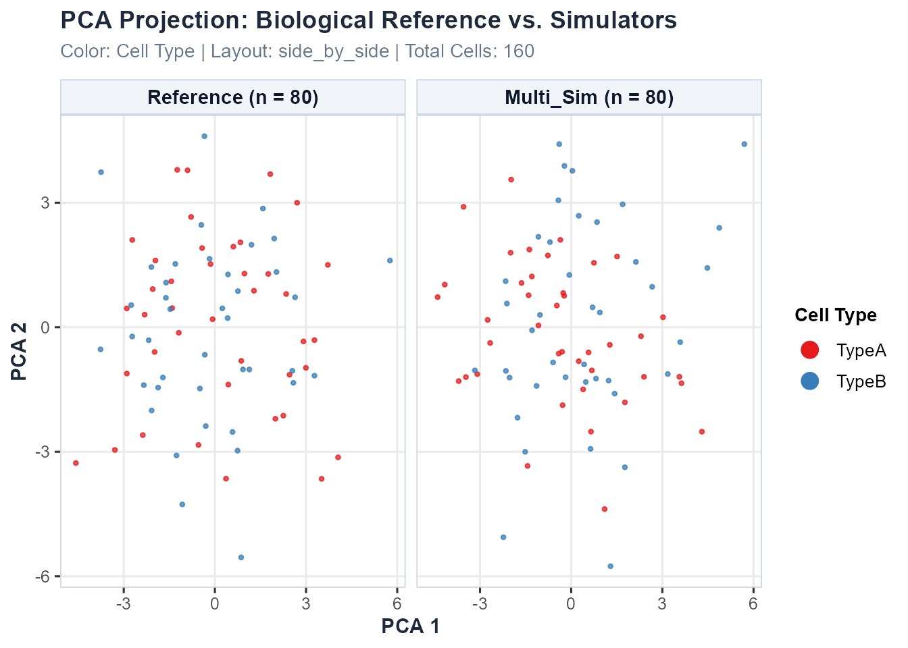

# Demonstration 3: Multiomics (scRNA-seq + scATAC-seq) Simulation Evaluation

## Introduction

Single-cell multiomics technologies allow simultaneous or parallel
measurement of multiple cellular features — most commonly gene
expression (scRNA-seq) and chromatin accessibility (scATAC-seq).
Simulating multiomics data presents unique challenges because algorithms
must preserve not only the distinct statistical properties of each
individual modality, but also the biological coupling and regulatory
relationships between them.

`scSimEval` is designed to evaluate simulation fidelity across **three
distinct multiomics experimental designs**, each with a different level
of cell-level pairing between modalities. Understanding which design
your simulated data belongs to is essential for selecting the correct
evaluation functions.

------------------------------------------------------------------------

## Part 1: Understanding Multiomics Data Types

### 1.1 Paired Multiomics (Co-assay)

**Definition:** Both scRNA-seq and scATAC-seq are measured
**simultaneously from the exact same individual cells**. Each cell
barcode in the RNA matrix has a corresponding and biologically
meaningful entry at the same column index in the ATAC matrix.

**Technologies:** 10x Chromium Multiome, SHARE-seq, SNARE-seq,
Paired-seq, ASTAR-seq

**Simulators:** scMultiSim (Li et al., *Nat Methods* 2023),
SymSim2+ATAC, MultiSim

**What scSimEval can evaluate:**

- ✅ Full unimodal evaluation for each modality (Categories 1–6 and 8)
- ✅ **All** Category 7 cross-modal coupling metrics:
  - FOSCTTM and <Match@1> (cell alignment in joint embedding space)
  - Cross-modal generation fidelity (predict ATAC from RNA, or vice
    versa)
  - Direct peak-to-gene regulatory linkage (promoter/enhancer
    accessibility vs. transcription)
  - Cross-modality feature correlation fidelity
  - Modality alignment and mixing score in joint latent space

------------------------------------------------------------------------

### 1.2 Unpaired Multiomics (Independent profiling)

**Definition:** scRNA-seq and scATAC-seq are profiled **from different
cells** derived from the same biological tissue, cell line, or sample.
Cell barcodes do **not** correspond between modalities — column *i* of
the RNA matrix and column *i* of the ATAC matrix represent entirely
different cells.

**Technologies:** Bulk ATAC + scRNA-seq, independent 10x scATAC + scRNA
experiments on the same tissue, sci-ATAC-seq paired with scRNA-seq on
sibling aliquots

**Simulators:** Splatter (RNA only) + ArchR (ATAC only) used separately,
AMULET

**What scSimEval can evaluate:**

- ✅ Full unimodal evaluation for each modality independently
  (Categories 1–6 and 8)
- ✅ **Population-level** cross-modal metrics that do not require
  cell-by-cell pairing:
  - Cross-modal label transfer accuracy
    (`evaluate_cross_modal_prediction`)
  - Co-expression module fidelity (`calc_coexpression_module_fidelity`)
  - Peak co-accessibility fidelity
    (`calc_peak_coaccessibility_fidelity`)
  - Network topology similarity (`calc_network_jaccard`)
  - Chromatin accessibility profile concordance
    (`calc_accessibility_profile_concordance`)
- ❌ **NOT applicable** (require 1-to-1 cell pairing):
  - FOSCTTM and <Match@1> (`calc_foscttm`)
  - Cross-modal generation fidelity (`calc_cross_modal_generation`)
  - Peak-to-gene regulatory coupling (`calc_atac_rna_coupling`)
  - Cross-modality correlation (`calc_cross_modality_correlation`)

> **Note:** Using
> [`evaluate_multiomics_accuracy()`](https://kabilanbio.github.io/scSimEval/reference/evaluate_multiomics_accuracy.md)
> directly on unpaired data is NOT recommended because it internally
> calls paired metrics. Instead, use
> [`evaluate_simulation_accuracy()`](https://kabilanbio.github.io/scSimEval/reference/evaluate_simulation_accuracy.md)
> per modality plus the population-level functions listed above, and
> combine results with
> [`evaluate_multiple_datasets()`](https://kabilanbio.github.io/scSimEval/reference/evaluate_multiple_datasets.md).

------------------------------------------------------------------------

### 1.3 Mosaic Multiomics (Partial co-measurement)

**Definition:** A **subset of cells** has measurements in both
modalities, while the remaining cells have measurements in only one
modality. This arises from experimental designs that pool paired and
unpaired samples, or from modality dropout in co-assay experiments.

**Technologies:** DOGMA-seq (DNA + RNA + protein + ATAC, but with high
dropout), mosaic pooling designs (mixing Multiome cells with scRNA-only
or scATAC-only cells), partially overlapping patient cohorts

**Simulators:** MultiVI (Lopez et al., *Nat Methods* 2023), Cobolt,
MOFA+ imputation

**What scSimEval can evaluate:**

- ✅ Full unimodal evaluation on the **complete** single-modality
  matrices (Categories 1–6, 8)
- ✅ Paired Category 7 coupling metrics on the **co-assayed cell subset
  only**
- ✅ Population-level cross-modal metrics on the full matrices
- ⚠️ Recommendation: Extract the co-assayed subset first, then call
  paired metrics on it

------------------------------------------------------------------------

### 1.4 Metric Compatibility Summary

| Metric / Function | Paired | Unpaired | Mosaic (paired subset) |
|----|:--:|:--:|:--:|
| [`evaluate_simulation_accuracy()`](https://kabilanbio.github.io/scSimEval/reference/evaluate_simulation_accuracy.md) per modality | ✅ | ✅ | ✅ |
| [`evaluate_clustering_metrics()`](https://kabilanbio.github.io/scSimEval/reference/evaluate_clustering_metrics.md) | ✅ | ✅ | ✅ |
| [`evaluate_batch_metrics()`](https://kabilanbio.github.io/scSimEval/reference/evaluate_batch_metrics.md) | ✅ | ✅ | ✅ |
| [`evaluate_deg_fidelity()`](https://kabilanbio.github.io/scSimEval/reference/evaluate_deg_fidelity.md) | ✅ | ✅ | ✅ |
| [`evaluate_trajectory_metrics()`](https://kabilanbio.github.io/scSimEval/reference/evaluate_trajectory_metrics.md) | ✅ | ✅ | ✅ |
| [`calc_coexpression_module_fidelity()`](https://kabilanbio.github.io/scSimEval/reference/calc_coexpression_module_fidelity.md) | ✅ | ✅ | ✅ |
| [`calc_peak_coaccessibility_fidelity()`](https://kabilanbio.github.io/scSimEval/reference/calc_peak_coaccessibility_fidelity.md) | ✅ | ✅ | ✅ |
| [`calc_accessibility_profile_concordance()`](https://kabilanbio.github.io/scSimEval/reference/calc_accessibility_profile_concordance.md) | ✅ | ✅ | ✅ |
| [`calc_network_jaccard()`](https://kabilanbio.github.io/scSimEval/reference/calc_network_jaccard.md) | ✅ | ✅ | ✅ |
| [`evaluate_cross_modal_prediction()`](https://kabilanbio.github.io/scSimEval/reference/evaluate_cross_modal_prediction.md) | ✅ | ✅ | ✅ |
| [`calc_modality_alignment()`](https://kabilanbio.github.io/scSimEval/reference/calc_modality_alignment.md) | ✅ | ⚠️ needs integration first | ✅ on subset |
| **[`calc_foscttm()`](https://kabilanbio.github.io/scSimEval/reference/calc_foscttm.md)** | ✅ | ❌ | ✅ on subset |
| **[`calc_cross_modal_generation()`](https://kabilanbio.github.io/scSimEval/reference/calc_cross_modal_generation.md)** | ✅ | ❌ | ✅ on subset |
| **[`calc_atac_rna_coupling()`](https://kabilanbio.github.io/scSimEval/reference/calc_atac_rna_coupling.md)** | ✅ | ❌ | ✅ on subset |
| **[`calc_cross_modality_correlation()`](https://kabilanbio.github.io/scSimEval/reference/calc_cross_modality_correlation.md)** | ✅ | ❌ | ✅ on subset |
| **[`evaluate_multiomics_accuracy()`](https://kabilanbio.github.io/scSimEval/reference/evaluate_multiomics_accuracy.md)** | ✅ | ❌ direct use | ✅ on subset |

------------------------------------------------------------------------

## Part 2: Evaluating Paired Multiomics

### 2.1 Loading the Example Paired Dataset

`scSimEval` includes a paired scRNA-seq + scATAC-seq dataset
(`example_multiomics`) where every column in the RNA matrix corresponds
to the same cell in the ATAC matrix:

``` r
library(scSimEval)

# Load packaged paired multiomics example dataset
data(example_multiomics)

cat("Reference RNA dimensions:", dim(example_multiomics$ref_multi$rna), "\n")
#> Reference RNA dimensions: 60 80
cat("Reference ATAC dimensions:", dim(example_multiomics$ref_multi$atac), "\n")
#> Reference ATAC dimensions: 60 80
cat("Simulated RNA dimensions:", dim(example_multiomics$sim_multi$rna), "\n")
#> Simulated RNA dimensions: 60 80
cat("Simulated ATAC dimensions:", dim(example_multiomics$sim_multi$atac), "\n")
#> Simulated ATAC dimensions: 60 80
cat("Cell types:", levels(example_multiomics$cell_types), "\n")
#> Cell types: TypeA TypeB
```

The dataset contains:

- `ref_multi`: Named list `rna` (count matrix) and `atac` (peak
  accessibility matrix), both measured from the **same cells**.
- `sim_multi`: Simulated paired `rna` and `atac` matrices.
- `cell_types`: Cell type annotations shared across both modalities.
- `batch_info`: Batch labels shared across both modalities.
- `resource_stats`: Hardware logs (runtime in seconds and peak RAM in
  MiB).

------------------------------------------------------------------------

### 2.2 Alignment in Joint Embedding Space (FOSCTTM & <Match@1>)

FOSCTTM (Fraction Of Samples Closer Than The True Match) quantifies
whether paired cells are each other’s nearest neighbors in joint latent
space. **Valid only for paired data.**

``` r
# Compute reduced representations (PCA) for RNA and ATAC
pca_rna  <- prcomp(t(example_multiomics$ref_multi$rna), rank. = 5)$x
pca_atac <- prcomp(t(example_multiomics$ref_multi$atac), rank. = 5)$x

foscttm_res <- calc_foscttm(x = pca_rna, y = pca_atac)

cat("Bidirectional FOSCTTM score:", round(foscttm_res$foscttm, 4), "\n")
#> Bidirectional FOSCTTM score: 0.455
cat("Top-1 Match Rate (Match@1):", round(foscttm_res$match_at_1, 4), "\n")
#> Top-1 Match Rate (Match@1): 0.0125
```

A score of 0.00 indicates perfect alignment; 0.50 represents random
chance.

------------------------------------------------------------------------

### 2.3 Cross-Modal Cell Type Label Transfer

Tests whether chromatin accessibility profiles in simulated ATAC can
predict cell types annotated in RNA. This metric works for **all three
data types** because it uses population-level kNN classification:

``` r
transfer_res <- evaluate_cross_modal_prediction(
  mod1_data  = example_multiomics$sim_multi$atac,
  cell_types = example_multiomics$cell_types
)

cat("Cross-Modal Prediction Accuracy:", round(transfer_res$cross_modal_accuracy, 4), "\n")
#> Cross-Modal Prediction Accuracy: 0.8125
cat("Cross-Modal Macro F1 Score:", round(transfer_res$cross_modal_F1, 4), "\n")
#> Cross-Modal Macro F1 Score: 0.8057
```

------------------------------------------------------------------------

### 2.4 Master Paired Pipeline: `evaluate_multiomics_accuracy()`

For fully paired data, the master function coordinates all 8 categories:

``` r
master_eval <- evaluate_multiomics_accuracy(
  ref_multi  = example_multiomics$ref_multi,
  sim_multi  = example_multiomics$sim_multi,
  cell_types = example_multiomics$cell_types,
  elapsed_time = example_multiomics$resource_stats$elapsed_time,
  memory_mb    = example_multiomics$resource_stats$memory_mb,
  verbose      = FALSE
)

head(master_eval$benchmark_summary_table)
#>                    Category     Property        Metric        Value Modality
#> 1 Distributional Properties library_size           MAD 1.500000e+01      rna
#> 2 Distributional Properties library_size            KS 2.125000e-01      rna
#> 3 Distributional Properties library_size           MAE 1.506250e+01      rna
#> 4 Distributional Properties library_size          RMSE 1.571504e+01      rna
#> 5 Distributional Properties library_size            OV 8.269394e-01      rna
#> 6 Distributional Properties library_size Bhattacharyya 1.188839e-04      rna
```

------------------------------------------------------------------------

## Part 3: Evaluating Unpaired Multiomics

For unpaired data, scRNA-seq and scATAC-seq come from **different
cells**. The recommended workflow is to evaluate each modality
independently and combine results.

### 3.1 Step-by-Step Workflow for Unpaired Data

``` r
library(scSimEval)
data(example_scrna)   # RNA modality
data(example_scatac)  # ATAC modality (different cells)

# ── Step 1: Evaluate each modality independently ──────────────────────────────
rna_eval <- evaluate_simulation_accuracy(
  ref_data = example_scrna$ref,
  sim_data = example_scrna$sim,
  compute_bivariate = FALSE,
  verbose = FALSE
)

atac_eval <- evaluate_simulation_accuracy(
  ref_data = example_scatac$ref,
  sim_data = example_scatac$sim,
  compute_bivariate = FALSE,
  verbose = FALSE
)

# ── Step 2: Population-level cross-modal metrics (no cell pairing needed) ─────

# 2a. Co-expression module fidelity (RNA only, no pairing needed)
module_fid <- calc_coexpression_module_fidelity(
  ref_mat = example_scrna$ref,
  sim_mat = example_scrna$sim
)
cat("Module correlation r:", round(module_fid$module_correlation_r, 4), "\n")

# 2b. Peak co-accessibility fidelity (ATAC only, no pairing needed)
coaccess_fid <- calc_peak_coaccessibility_fidelity(
  ref_atac = example_scatac$ref,
  sim_atac = example_scatac$sim
)
cat("RV coefficient:", round(coaccess_fid$rv_coefficient, 4), "\n")

# 2c. Cross-modal label transfer (uses ATAC features to predict RNA-based labels)
# NOTE: cell_types come from the RNA experiment; applied to ATAC data for transfer
label_transfer <- evaluate_cross_modal_prediction(
  mod1_data  = example_scatac$sim,
  cell_types = example_scatac$cell_types
)
cat("Label transfer accuracy:", round(label_transfer$cross_modal_accuracy, 4), "\n")

# ── Step 3: Consolidate and compare across modalities ─────────────────────────
dataset_collection <- list(
  "Method_A-RNA"  = list(ref = example_scrna$ref,  sim = example_scrna$sim),
  "Method_A-ATAC" = list(ref = example_scatac$ref, sim = example_scatac$sim)
)

consolidated <- evaluate_multiple_datasets(
  datasets          = dataset_collection,
  pair_by_prefix    = TRUE,
  compute_bivariate = FALSE,
  verbose           = FALSE
)

print(consolidated$dataset_overview)
```

> **Key point:** Do NOT call
> [`calc_foscttm()`](https://kabilanbio.github.io/scSimEval/reference/calc_foscttm.md),
> [`calc_cross_modal_generation()`](https://kabilanbio.github.io/scSimEval/reference/calc_cross_modal_generation.md),
> [`calc_atac_rna_coupling()`](https://kabilanbio.github.io/scSimEval/reference/calc_atac_rna_coupling.md),
> or
> [`calc_cross_modality_correlation()`](https://kabilanbio.github.io/scSimEval/reference/calc_cross_modality_correlation.md)
> on unpaired data. These functions assume row/column `i` of the RNA
> matrix matches row/column `i` of the ATAC matrix — an assumption that
> is biologically false for unpaired experiments.

------------------------------------------------------------------------

## Part 4: Evaluating Mosaic Multiomics

For mosaic data (where only some cells have both modalities), the
strategy is:

1.  **Extract co-assayed cells** — the subset that has measurements in
    both RNA and ATAC.
2.  **Run paired metrics** on this subset using
    [`evaluate_multiomics_accuracy()`](https://kabilanbio.github.io/scSimEval/reference/evaluate_multiomics_accuracy.md)
    or individual Category 7 functions.
3.  **Run unimodal metrics** on the full single-modality matrices.

### 4.1 Step-by-Step Workflow for Mosaic Data

``` r
# Suppose your mosaic simulator output looks like this:
# - sim_rna_full: RNA matrix for ALL cells (including RNA-only cells)
# - sim_atac_full: ATAC matrix for ALL cells (including ATAC-only cells)
# - paired_cell_idx: logical or integer index of cells with BOTH modalities

# ── Step 1: Identify co-assayed cell subset ───────────────────────────────────
# (This index should come from your simulator's output metadata)
# Example: first 200 cells are co-assayed, rest are single-modality
paired_idx   <- 1:200

sim_rna_paired  <- sim_rna_full[, paired_idx]
sim_atac_paired <- sim_atac_full[, paired_idx]
ref_rna_paired  <- ref_rna_full[, paired_idx]
ref_atac_paired <- ref_atac_full[, paired_idx]

# ── Step 2: Paired coupling metrics on the co-assayed subset ──────────────────
paired_eval <- evaluate_multiomics_accuracy(
  ref_multi  = list(rna = ref_rna_paired, atac = ref_atac_paired),
  sim_multi  = list(rna = sim_rna_paired, atac = sim_atac_paired),
  cell_types = cell_types_paired,
  verbose    = FALSE
)

# ── Step 3: Full unimodal evaluation on the complete matrices ─────────────────
rna_full_eval <- evaluate_simulation_accuracy(
  ref_data = ref_rna_full,
  sim_data = sim_rna_full,
  compute_bivariate = FALSE,
  verbose = FALSE
)

atac_full_eval <- evaluate_simulation_accuracy(
  ref_data = ref_atac_full,
  sim_data = sim_atac_full,
  compute_bivariate = FALSE,
  verbose = FALSE
)

# ── Step 4: Population-level cross-modal metrics (full matrices) ──────────────
module_fid <- calc_coexpression_module_fidelity(ref_rna_full, sim_rna_full)
coaccess   <- calc_peak_coaccessibility_fidelity(ref_atac_full, sim_atac_full)
```

------------------------------------------------------------------------

## Part 5: Visualization

`scSimEval` visualization functions work seamlessly across unimodal,
paired, and unpaired multiomics configurations:

``` r
# Multi-dataset consolidated benchmark bubble matrix
plot_benchmark_bubble_matrix(
  data  = consolidated,
  title = "Benchmarking Multiomics Simulators"
)

# Evaluation summary horizontal bar matrix
plot_evaluation_summary(
  data  = consolidated,
  title = "Multiomics Simulator Leaderboard"
)
```

### 5.1 Low-Dimensional Multiomics Cell Embeddings

To visually examine whether simulated cells maintain the biological
manifold of empirical data across modalities, researchers can project
reference and simulated cells into low-dimensional UMAP, t-SNE, or PCA
coordinates:

``` r
# Compute low-dimensional embeddings for the scRNA-seq modality
emb_rna <- compute_dataset_embeddings(
  reference   = example_multiomics$ref_multi$rna,
  simulated   = list("Multi_Sim" = example_multiomics$sim_multi$rna),
  reduction   = "pca",
  n_pcs       = 5,
  cell_types  = example_multiomics$cell_types
)

# Plot multiomics cell embeddings
plot_dataset_embeddings(
  embedding_data = emb_rna,
  reduction      = "pca",
  layout         = "side_by_side",
  color_by       = "cell_type"
)
```



``` r

# Quantitative embedding quality metrics
knitr::kable(compute_embedding_quality_metrics(emb_rna), digits = 4)
```

| Dataset | Role | Cells (N) | Mean Silhouette | ARI (Cluster Fidelity) | Mean Library Size | Mean Detected Features | Library Size Diff (%) |
|:---|:---|---:|---:|---:|---:|---:|---:|
| Reference | Reference | 80 | -0.0101 | -0.0027 | 256.3 | 49.2 | 0.00 |
| Multi_Sim | Simulated | 80 | 0.0037 | -0.0071 | 242.3 | 48.3 | 5.46 |

------------------------------------------------------------------------

## Part 6: Summary

| Data Type | Example Technologies | [`evaluate_multiomics_accuracy()`](https://kabilanbio.github.io/scSimEval/reference/evaluate_multiomics_accuracy.md) | Category 7 Metrics | Recommended Function |
|----|----|:--:|:--:|----|
| **Paired** | 10x Multiome, SHARE-seq | ✅ Direct | All 6 metrics | [`evaluate_multiomics_accuracy()`](https://kabilanbio.github.io/scSimEval/reference/evaluate_multiomics_accuracy.md) |
| **Unpaired** | Independent scRNA + scATAC | ❌ Not valid | Modularity, label transfer, network only | [`evaluate_simulation_accuracy()`](https://kabilanbio.github.io/scSimEval/reference/evaluate_simulation_accuracy.md) × 2 + [`evaluate_multiple_datasets()`](https://kabilanbio.github.io/scSimEval/reference/evaluate_multiple_datasets.md) |
| **Mosaic** | DOGMA-seq, mosaic pooling | ✅ On paired subset | All 6 metrics on paired subset | Subset first, then [`evaluate_multiomics_accuracy()`](https://kabilanbio.github.io/scSimEval/reference/evaluate_multiomics_accuracy.md) |

The most important rule: **Cell-pairing metrics (FOSCTTM, cross-modal
generation, peak-to-gene coupling) are only scientifically valid when
the RNA and ATAC columns correspond to the same physical cells.** For
unpaired and mosaic data, rely on population-level metrics and
per-modality unimodal evaluation.

``` r
sessionInfo()
#> R version 4.6.1 (2026-06-24 ucrt)
#> Platform: x86_64-w64-mingw32/x64
#> Running under: Windows 11 x64 (build 26200)
#> 
#> Matrix products: default
#>   LAPACK version 3.12.1
#> 
#> locale:
#> [1] LC_COLLATE=English_India.utf8  LC_CTYPE=English_India.utf8   
#> [3] LC_MONETARY=English_India.utf8 LC_NUMERIC=C                  
#> [5] LC_TIME=English_India.utf8    
#> 
#> time zone: Asia/Calcutta
#> tzcode source: internal
#> 
#> attached base packages:
#> [1] stats     graphics  grDevices utils     datasets  methods   base     
#> 
#> other attached packages:
#> [1] scSimEval_0.99.3
#> 
#> loaded via a namespace (and not attached):
#>  [1] tidyselect_1.2.1            ade4_1.7-24                
#>  [3] dplyr_1.2.1                 farver_2.1.2               
#>  [5] S7_0.2.2                    fastmap_1.2.0              
#>  [7] SingleCellExperiment_1.34.0 RANN_2.6.2                 
#>  [9] bluster_1.22.0              digest_0.6.39              
#> [11] lifecycle_1.0.5             cluster_2.1.8.3            
#> [13] statmod_1.5.2               magrittr_2.0.5             
#> [15] kernlab_0.9-33              compiler_4.6.1             
#> [17] rlang_1.3.0                 sass_0.4.10                
#> [19] tools_4.6.1                 igraph_2.3.3               
#> [21] yaml_2.3.12                 knitr_1.51                 
#> [23] labeling_0.4.3              S4Arrays_1.13.0            
#> [25] htmlwidgets_1.6.4           mclust_6.1.3               
#> [27] DelayedArray_0.38.2         RColorBrewer_1.1-3         
#> [29] abind_1.4-8                 BiocParallel_1.47.0        
#> [31] withr_3.0.3                 BiocGenerics_0.58.1        
#> [33] desc_1.4.3                  nnet_7.3-21                
#> [35] grid_4.6.1                  stats4_4.6.1               
#> [37] e1071_1.7-17                edgeR_4.10.1               
#> [39] ggplot2_4.0.3               scales_1.4.0               
#> [41] fpc_2.2-15                  MASS_7.3-66                
#> [43] prabclus_2.3-5              dichromat_2.0-1            
#> [45] SummarizedExperiment_1.42.0 cli_3.6.6                  
#> [47] rmarkdown_2.31              ragg_1.5.2                 
#> [49] generics_0.1.4              otel_0.2.0                 
#> [51] robustbase_0.99-7           cachem_1.1.0               
#> [53] proxy_0.4-29                modeltools_0.2-24          
#> [55] splines_4.6.1               clValid_0.7                
#> [57] parallel_4.6.1              XVector_0.52.0             
#> [59] vctrs_0.7.3                 matrixStats_1.5.0          
#> [61] Matrix_1.7-6                jsonlite_2.0.0             
#> [63] IRanges_2.46.0              S4Vectors_0.50.1           
#> [65] BiocNeighbors_2.6.0         irlba_2.3.7                
#> [67] clue_0.3-68                 systemfonts_1.3.2          
#> [69] locfit_1.5-9.12             diptest_0.77-2             
#> [71] limma_3.68.4                jquerylib_0.1.4            
#> [73] glue_1.8.1                  pkgdown_2.2.1              
#> [75] DEoptimR_1.2-0              codetools_0.2-20           
#> [77] gtable_0.3.6                GenomicRanges_1.64.0       
#> [79] tibble_3.3.1                pillar_1.11.1              
#> [81] htmltools_0.5.9             Seqinfo_1.2.0              
#> [83] clusterSim_0.51-6           R6_2.6.1                   
#> [85] textshaping_1.0.5           evaluate_1.0.5             
#> [87] lattice_0.22-9              Biobase_2.73.2             
#> [89] bslib_0.12.0                class_7.3-24               
#> [91] Rcpp_1.1.2                  flexmix_2.3-21             
#> [93] SparseArray_1.13.2          xfun_0.60                  
#> [95] fs_2.1.0                    MatrixGenerics_1.24.0      
#> [97] pkgconfig_2.0.3
```
