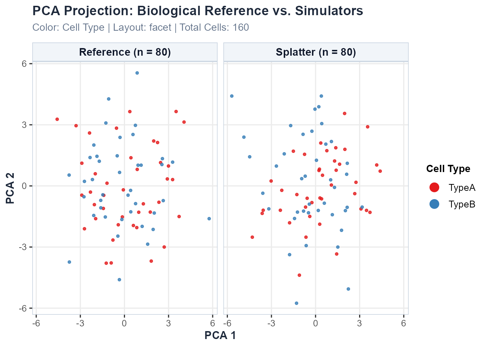

# Getting Started with scSimEval: Unified Benchmarking for Single-Cell Multiomics Simulations

## 1. Introduction

Computer simulations of single-cell technologies—specifically
single-cell RNA sequencing (**scRNA-seq**), single-cell ATAC sequencing
(**scATAC-seq**), and paired **scRNA-seq + scATAC-seq multiomics**—are
widely used in bioinformatics research. They help scientists test
computational pipelines, optimize analysis workflows, and evaluate
statistical models. A critical question is always: *how realistic is the
simulated data compared to genuine biological experiments?*

Many existing evaluation tools require artificial “ground truth” labels
that are rarely known in real experiments, such as predefined true gene
networks or synthetic marker lists.

**`scSimEval`** solves this problem by providing **62 evaluation
measures organized into 8 easy-to-understand categories**. It works
directly with the real experimental data and simulated data you already
have, without needing any artificial ground truth:

1.  **Real experimental reference data** (`ref_rna`, `ref_atac`)
2.  **Simulated synthetic data** (`sim_rna`, `sim_atac`)
3.  **Cell type annotations** (`cell_types`)
4.  **Batch or donor identifiers** (`batch_info`)
5.  **Computer resources** (Runtime in seconds and peak RAM in MiB)
6.  **Developmental trajectories** (automatically inferred directly from
    scRNA-seq counts without requiring external tools)

> **Data Modalities:** `scSimEval` supports three multiomics
> experimental designs: **Paired** (co-assay from identical cells,
> e.g. 10x Multiome, SHARE-seq) — full evaluation including all Category
> 7 coupling metrics; **Unpaired** (independent scRNA-seq + scATAC-seq
> from separate cells) — unimodal evaluation per modality plus
> population-level cross-modal metrics (module fidelity, network
> overlap, label transfer); and **Mosaic** (partial co-measurement,
> e.g. DOGMA-seq) — unimodal evaluation on full matrices plus paired
> coupling metrics applied to the co-assayed cell subset. See the
> dedicated [Multiomics
> vignette](https://kabilanbio.github.io/scSimEval/articles/demo-multiomics.md)
> for full details.

------------------------------------------------------------------------

## 2. Package Architecture and Workflow

The following workflow diagram shows the step-by-step benchmarking
process in `scSimEval`:


**Figure 1: End-to-end benchmarking workflow of scSimEval.** The
framework takes real and simulated single-cell multiomics data,
evaluates 62 metrics across 8 foundational categories, and produces
standardized scores, comprehensive figures, and ranking leaderboards.

The evaluation process follows four simple steps:

### Step 1: Input Real and Simulated Data

Provide your real experimental reference and simulated count matrices
(`ref_rna`, `sim_rna`, `ref_atac`, `sim_atac`), along with cell type
labels (`cell_types`), batch labels (`batch_info`), and computer
resource records (runtime in seconds and peak RAM in MiB).

### Step 2: Calculate Evaluation Measures

`scSimEval` calculates 62 evaluation measures across 8 core categories
without needing any artificial ground truth.

### Step 3: Run the Complete Benchmark

Execute the complete evaluation in a single command using
[`evaluate_simulation_accuracy()`](https://kabilanbio.github.io/scSimEval/reference/evaluate_simulation_accuracy.md),
[`evaluate_multiomics_accuracy()`](https://kabilanbio.github.io/scSimEval/reference/evaluate_multiomics_accuracy.md),
or
[`evaluate_multiple_datasets()`](https://kabilanbio.github.io/scSimEval/reference/evaluate_multiple_datasets.md).

### Step 4: Review Scores, Rankings, and Figures

Review clean summary tables, standardized scores ($`0.00`$ to $`1.00`$),
simulator ranking leaderboards, and high-resolution figures.

------------------------------------------------------------------------

## 3. Score Normalization and Visual Mapping Workflow

In single-cell benchmarking, different metrics have completely different
units and directions. For example, runtime is in seconds, peak memory is
in megabytes, statistical distances are near zero, and clustering
accuracy ranges between -1 and 1. Furthermore, for some metrics, smaller
values are better (such as distance, error, and runtime), whereas for
others, larger values are better (such as correlation and accuracy).

To make fair and intuitive comparisons, `scSimEval` uses an automated
**two-step score normalization pipeline**, followed by clear **visual
mapping**:


**Figure 2: Score normalization and visual mapping workflow in
scSimEval.** Box 1 shows the two-step normalization process: direction
inversion for lower-is-better metrics followed by min-max scaling to a
standard 0 to 1 range. Box 2 illustrates the visual mapping into bubble
matrices, where bubble size reflects simulation quality and top
performers are highlighted with bold squares.

### 3.1 Two-Step Score Normalization

1.  **Step 1: Direction Inversion (Aligning Direction)** For all metrics
    where smaller values mean better simulation results (such as
    Kolmogorov-Smirnov distance, Wasserstein distance, root mean square
    error, and runtime), scores are inverted:
    ``` math
    \text{Inverted Value} = \text{Maximum} - \text{Value}
    ```
    After inversion, larger numbers consistently represent better
    simulation fidelity across every metric.

2.  **Step 2: Min-Max Scaling ($`0.00`$ to $`1.00`$)** All values are
    rescaled to a standard range from $`0.00`$ (worst performer) to
    $`1.00`$ (best performer):
    ``` math
    \text{Standardized Score} = \frac{\text{Value} - \text{Minimum}}{\text{Maximum} - \text{Minimum}}
    ```

### 3.2 Visual Mapping to Bubble Matrices

- **Bubble Size:** Directly represents the standardized score ($`0.00`$
  to $`1.00`$). Larger bubbles indicate higher simulation quality and
  closer match to real biology.
- **Top-Performer Highlighting:** Outstanding scores ($`\ge 0.96`$) are
  shown as bold squares, while standard scores are shown as filled
  circles.
- **Category Color Themes:** Each metric category has its own distinct
  color (for example, blue for distributions, green for marker genes,
  and orange for computer speed).
- **Missing Feature Dots:** Features or modalities not supported by a
  simulator appear as neutral, small grey dots.
- **Overall Leaderboard Ranking:** Simulators are arranged vertically
  from top to bottom by their composite average score across all
  criteria.

------------------------------------------------------------------------

## 4. Installation and Getting Started

To install and load **`scSimEval`** directly from GitHub:

\
`# Install devtools if needed`\
`if`` ``(``!`[`requireNamespace`](https://rdrr.io/r/base/ns-load.html)`(``"devtools"``, quietly ``=`` ``TRUE``)``)`` `[`install.packages`](https://rdrr.io/r/utils/install.packages.html)`(``"devtools"``)`\
\
`# Install scSimEval from GitHub`\
`devtools``::`[`install_github`](https://devtools.r-lib.org/reference/install-deprecated.html)`(``"kabilanbio/scSimEval"``)`\
\
`# Load the package`\
[`library`](https://rdrr.io/r/base/library.html)`(`[`scSimEval`](https://kabilanbio.github.io/scSimEval)`)`

`scSimEval` includes built-in example datasets so you can test all
functions immediately: \* **`example_scrna`**: Paired real and simulated
scRNA-seq matrices ($`60\text{ genes} \times 80\text{ cells}`$) with
cell type labels and batches. \* **`example_scatac`**: Paired real and
simulated scATAC-seq chromatin accessibility matrices
($`60\text{ peaks} \times 80\text{ cells}`$). \*
**`example_multiomics`**: A paired bundle containing both RNA and ATAC
modalities, cell labels, and computer resource logs.

\
`# Load example datasets`\
[`data`](https://rdrr.io/r/utils/data.html)`(``example_scrna``)`\
[`data`](https://rdrr.io/r/utils/data.html)`(``example_scatac``)`\
[`data`](https://rdrr.io/r/utils/data.html)`(``example_multiomics``)`\
\
`# Check dimensions`\
[`cat`](https://rdrr.io/r/base/cat.html)`(``"Real scRNA-seq dimensions:"``, `[`dim`](https://rdrr.io/r/base/dim.html)`(``example_scrna``$``ref``)``, ``"\n"``)`\
`#> Real scRNA-seq dimensions: 60 80`\
[`cat`](https://rdrr.io/r/base/cat.html)`(``"Simulated scRNA-seq dimensions:"``, `[`dim`](https://rdrr.io/r/base/dim.html)`(``example_scrna``$``sim``)``, ``"\n"``)`\
`#> Simulated scRNA-seq dimensions: 60 80`\
[`cat`](https://rdrr.io/r/base/cat.html)`(``"Cell types present:"``, `[`levels`](https://rdrr.io/r/base/levels.html)`(``example_scrna``$``cell_types``)``, ``"\n"``)`\
`#> Cell types present: TypeA TypeB`

------------------------------------------------------------------------

## 5. Evaluating Data Properties and Distributions

The function
[`evaluate_simulation_accuracy()`](https://kabilanbio.github.io/scSimEval/reference/evaluate_simulation_accuracy.md)
evaluates 1D and 2D statistical distributions and zero-count patterns
between real and simulated matrices:

\
`# Evaluate unimodal accuracy on scRNA-seq`\
`unimodal_res`` ``<-`` `[`evaluate_simulation_accuracy`](https://kabilanbio.github.io/scSimEval/reference/evaluate_simulation_accuracy.md)`(`\
`  ref_data ``=`` ``example_scrna``$``ref``,`\
`  sim_data ``=`` ``example_scrna``$``sim``,`\
`  compute_bivariate ``=`` ``FALSE``,`\
`  verbose ``=`` ``FALSE`\
`)`\
\
`# Preview library size distribution metrics`\
`lib_summary`` ``<-`` `[`subset`](https://rdrr.io/r/base/subset.html)`(``unimodal_res``$``metrics_summary_table``, ``Property`` ``==`` ``"library_size"``)`\
`knitr``::`[`kable`](https://rdrr.io/pkg/knitr/man/kable.html)`(`[`head`](https://rdrr.io/r/utils/head.html)`(``lib_summary``, ``8``)``, digits ``=`` ``4``, caption ``=`` ``"Library Size Statistical Distance Measures"``)`

| Category                  | Property     | Metric        |   Value |
|:--------------------------|:-------------|:--------------|--------:|
| Distributional Properties | library_size | MAD           | 15.0000 |
| Distributional Properties | library_size | KS            |  0.2125 |
| Distributional Properties | library_size | MAE           | 15.0625 |
| Distributional Properties | library_size | RMSE          | 15.7150 |
| Distributional Properties | library_size | OV            |  0.8269 |
| Distributional Properties | library_size | Bhattacharyya |  0.0001 |
| Distributional Properties | library_size | Wasserstein   | 15.0625 |
| Distributional Properties | library_size | ECDF_DiffArea |  0.0766 |

Library Size Statistical Distance Measures {.table}

### 5.1 Comparative Distribution QC Plot (`plot_distribution_qc`)

To visually inspect whether simulated counts match real biological
distributions,
[`plot_distribution_qc()`](https://kabilanbio.github.io/scSimEval/reference/plot_distribution_qc.md)
generates a clean 14-panel layout comparing properties such as library
size, mean expression, gene variance, zero proportions, and cell-cell
correlations:


**Figure 3: 14-panel comparative distribution QC layout.** Compares real
biological data (warm brick red) and simulated data (steel blue) across
single-cell properties, bivariate relationships, and biological signal
retention.

\
`# Generate the 14-panel comparative QC plot`\
[`plot_distribution_qc`](https://kabilanbio.github.io/scSimEval/reference/plot_distribution_qc.md)`(`\
`  ref_data   ``=`` ``example_scrna``$``ref``,`\
`  sim_data   ``=`` ``example_scrna``$``sim``,`\
`  title      ``=`` ``"Data Properties Quality Control"``,`\
`  ref_name   ``=`` ``"Real Data"``,`\
`  sim_name   ``=`` ``"Simulated Data"``,`\
`  cell_types ``=`` ``example_scrna``$``cell_types`\
`)`

------------------------------------------------------------------------

## 6. Evaluating Cell Clustering and Group Structure

To test whether simulated data preserve distinct cell populations and
cluster boundaries without requiring external truth,
[`evaluate_clustering_metrics()`](https://kabilanbio.github.io/scSimEval/reference/evaluate_clustering_metrics.md)
calculates cluster separation and concordance:

\
`clust_res`` ``<-`` `[`evaluate_clustering_metrics`](https://kabilanbio.github.io/scSimEval/reference/evaluate_clustering_metrics.md)`(`\
`  data ``=`` ``example_scrna``$``sim``,`\
`  cell_types ``=`` ``example_scrna``$``cell_types``,`\
`  ref_data ``=`` ``example_scrna``$``ref`\
`)`\
\
[`cat`](https://rdrr.io/r/base/cat.html)`(``"Average Silhouette Width:"``, `[`round`](https://rdrr.io/r/base/Round.html)`(``clust_res``$``silhouette``, ``4``)``, ``"\n"``)`\
`#> Average Silhouette Width: 0.0278`\
[`cat`](https://rdrr.io/r/base/cat.html)`(``"Davies-Bouldin Index:"``, `[`round`](https://rdrr.io/r/base/Round.html)`(``clust_res``$``davies_bouldin``, ``4``)``, ``"\n"``)`\
`#> Davies-Bouldin Index: 5.1752`\
[`cat`](https://rdrr.io/r/base/cat.html)`(``"Adjusted Rand Index (ARI):"``, `[`round`](https://rdrr.io/r/base/Round.html)`(``clust_res``$``ARI``, ``4``)``, ``"\n"``)`\
`#> Adjusted Rand Index (ARI): 0.0671`\
[`cat`](https://rdrr.io/r/base/cat.html)`(``"Normalized Mutual Information (NMI):"``, `[`round`](https://rdrr.io/r/base/Round.html)`(``clust_res``$``NMI``, ``4``)``, ``"\n"``)`\
`#> Normalized Mutual Information (NMI): 0.0884`

------------------------------------------------------------------------

## 7. Evaluating Batch Effects and Technical Confounders

When evaluating multi-batch or multi-donor simulations,
[`evaluate_batch_metrics()`](https://kabilanbio.github.io/scSimEval/reference/evaluate_batch_metrics.md)
checks whether technical batch differences are properly represented
without overshadowing biological variation:

\
`batch_res`` ``<-`` `[`evaluate_batch_metrics`](https://kabilanbio.github.io/scSimEval/reference/evaluate_batch_metrics.md)`(`\
`  data ``=`` ``example_scrna``$``sim``,`\
`  batch_info ``=`` ``example_scrna``$``batch_info``,`\
`  cell_types ``=`` ``example_scrna``$``cell_types``,`\
`  verbose ``=`` ``FALSE`\
`)`\
\
[`cat`](https://rdrr.io/r/base/cat.html)`(``"Batch Shannon Entropy:"``, `[`round`](https://rdrr.io/r/base/Round.html)`(``batch_res``$``shannon_entropy``, ``4``)``, ``"\n"``)`\
`#> Batch Shannon Entropy: 0.9796`\
[`cat`](https://rdrr.io/r/base/cat.html)`(``"PC Regression R2 (PCR):"``, `[`round`](https://rdrr.io/r/base/Round.html)`(``batch_res``$``pcr_r2``, ``4``)``, ``"\n"``)`\
`#> PC Regression R2 (PCR): 0.0121`\
[`cat`](https://rdrr.io/r/base/cat.html)`(``"Cross-Batch Transfer Accuracy:"``, `[`round`](https://rdrr.io/r/base/Round.html)`(``batch_res``$``cross_batch_accuracy``, ``4``)``, ``"\n"``)`\
`#> Cross-Batch Transfer Accuracy: 0.6125`

------------------------------------------------------------------------

## 8. Evaluating Cell Lineages and Developmental Trajectories

Instead of requiring external pseudotime labels, `scSimEval`
automatically infers differentiation paths directly from scRNA-seq
expression counts and compares the real and simulated trajectories:

\
`# Automatically infer trajectories and evaluate fidelity`\
`traj_res`` ``<-`` `[`evaluate_trajectory_metrics`](https://kabilanbio.github.io/scSimEval/reference/evaluate_trajectory_metrics.md)`(`\
`  ref_data ``=`` ``example_scrna``$``ref``,`\
`  sim_data ``=`` ``example_scrna``$``sim``,`\
`  cell_types_ref ``=`` ``example_scrna``$``cell_types``,`\
`  cell_types_sim ``=`` ``example_scrna``$``cell_types`\
`)`\
\
[`cat`](https://rdrr.io/r/base/cat.html)`(``"Pseudotime Spearman Correlation:"``, `[`round`](https://rdrr.io/r/base/Round.html)`(``traj_res``$``pseudotime_correlation``, ``4``)``, ``"\n"``)`\
`#> Pseudotime Spearman Correlation: 1`\
[`cat`](https://rdrr.io/r/base/cat.html)`(``"Lineage Tree Branch Height RMSE:"``, `[`round`](https://rdrr.io/r/base/Round.html)`(`[`as.numeric`](https://rdrr.io/r/base/numeric.html)`(``traj_res``$``tree_height_rmse``)``, ``4``)``, ``"\n"``)`\
`#> Lineage Tree Branch Height RMSE: 1.8672`

------------------------------------------------------------------------

## 9. Evaluating Biological Signals and Marker Genes (DEGs)

Simulated datasets must preserve the marker genes and expression
fold-changes found in genuine biological experiments. `scSimEval`
integrates 15 differentially expressed gene (DEG) fidelity measures from
three major benchmarking frameworks: \* **Simpipe (Duo et al., 2024):**
True DEG ratio, $`p`$-value uniformity on non-DEGs, and cell-identity
classification accuracy and $`F_1`$ score. \* **SimBench (Cao et al.,
2021):** Symmetric error on DEG proportions, fold-change Pearson and
Spearman correlations, and top-DEG Jaccard overlap. \* **Shaky
Foundations (Crowell et al., 2023):** Group silhouette width, group
separation discrepancy, and percent variance explained (PVE).

\
`# Evaluate marker gene and biological signal retention`\
`deg_res`` ``<-`` `[`evaluate_deg_fidelity`](https://kabilanbio.github.io/scSimEval/reference/evaluate_deg_fidelity.md)`(`\
`  ref_data              ``=`` ``example_scrna``$``ref``,`\
`  sim_data              ``=`` ``example_scrna``$``sim``,`\
`  ref_celltypes         ``=`` ``example_scrna``$``cell_types``,`\
`  sim_celltypes         ``=`` ``example_scrna``$``cell_types``,`\
`  fdr_cutoff            ``=`` ``0.05``,`\
`  logfc_cutoff          ``=`` ``0.5``,`\
`  top_n_de              ``=`` ``50`\
`)`\
\
`# View the first 10 metrics`\
`knitr``::`[`kable`](https://rdrr.io/pkg/knitr/man/kable.html)`(`[`head`](https://rdrr.io/r/utils/head.html)`(``deg_res``$``deg_summary_table``, ``10``)``, digits ``=`` ``4``)`

------------------------------------------------------------------------

## 10. Evaluating Computational Resource Usage (Scalability)

Simulating thousands or millions of single cells requires fast and
memory-efficient software.
[`plot_scalability_benchmark()`](https://kabilanbio.github.io/scSimEval/reference/plot_scalability_benchmark.md)
generates a comprehensive 6-panel dashboard comparing runtime, memory
usage, Pareto tradeoff frontiers, multithreading speedup, and cell
throughput:


**Figure 4: Computational scalability benchmark suite.** 6-panel
dashboard comparing execution runtime, peak RAM, runtime-memory
tradeoff, CPU efficiency, cost footprint, and throughput across
simulation methods.

\
`# Generate the 6-panel computational scalability dashboard`\
[`plot_scalability_benchmark`](https://kabilanbio.github.io/scSimEval/reference/plot_scalability_benchmark.md)`(`\
`  scalability_data ``=`` ``sim_comparison_list``,`\
`  mode ``=`` ``"composite"``,`\
`  panels ``=`` ``"6panel"`\
`)`

------------------------------------------------------------------------

## 11. Master Evaluation Pipeline: `evaluate_multiomics_accuracy`

The flagship function
[`evaluate_multiomics_accuracy()`](https://kabilanbio.github.io/scSimEval/reference/evaluate_multiomics_accuracy.md)
runs all evaluation categories in one command and returns a tidy summary
table:

\
`master_eval`` ``<-`` `[`evaluate_multiomics_accuracy`](https://kabilanbio.github.io/scSimEval/reference/evaluate_multiomics_accuracy.md)`(`\
`  ref_multi ``=`` ``example_multiomics``$``ref_multi``,`\
`  sim_multi ``=`` ``example_multiomics``$``sim_multi``,`\
`  cell_types ``=`` ``example_multiomics``$``cell_types``,`\
`  batch_info ``=`` ``example_multiomics``$``batch_info``,`\
`  memory_mb ``=`` ``example_multiomics``$``resource_stats``$``memory_mb``,`\
`  elapsed_time ``=`` ``example_multiomics``$``resource_stats``$``elapsed_time``,`\
`  verbose ``=`` ``FALSE`\
`)`\
\
`summary_df`` ``<-`` ``master_eval``$``benchmark_summary_table`\
[`cat`](https://rdrr.io/r/base/cat.html)`(``"Total evaluated metric instances:"``, `[`nrow`](https://rdrr.io/r/base/nrow.html)`(``summary_df``)``, ``"\n"``)`\
`#> Total evaluated metric instances: 358`\
[`table`](https://rdrr.io/r/base/table.html)`(``summary_df``$``Category``)`\
`#> `\
`#> Biological Signal & Downstream    Cellular Structure & Mixing `\
`#>                             10                             33 `\
`#>      Computational Scalability      Cross-Modal Relationships `\
`#>                              2                             17 `\
`#>      Distributional Properties            Trajectory Dynamics `\
`#>                            294                              2`

------------------------------------------------------------------------

## 12. Visualization Suite

`scSimEval` provides built-in plotting functions rendering
high-resolution figures (supporting 600 DPI for publication and
reporting needs).

### 12.1 Multi-Dimensional Benchmarking Bubble Matrix (`plot_benchmark_bubble_matrix`)

The flagship visualization
**[`plot_benchmark_bubble_matrix()`](https://kabilanbio.github.io/scSimEval/reference/plot_benchmark_bubble_matrix.md)**
summarizes multi-simulator performance across the 8 evaluation
categories. Bubble sizes indicate normalized simulation fidelity (larger
bubbles = better performance):


**Figure 5: Flagship multi-dimensional benchmarking bubble matrix.**
Ranks simulation methods top-to-bottom across the 8 evaluation
categories. Bubble size reflects standardized fidelity score ($`0.00`$
to $`1.00`$), and top performers are highlighted with bold squares.

\
`# Generate benchmark bubble matrix`\
[`plot_benchmark_bubble_matrix`](https://kabilanbio.github.io/scSimEval/reference/plot_benchmark_bubble_matrix.md)`(`\
`  data ``=`` ``sim_comparison_list``,`\
`  bubble_size_range ``=`` `[`c`](https://rdrr.io/r/base/c.html)`(``2``, ``7.5``)``,`\
`  title ``=`` ``"Benchmarking Single-Cell Simulation Methods"``,`\
`  subtitle ``=`` ``"Comparative performance across 8 evaluation categories"`\
`)`

### 12.2 Evaluation Summary Horizontal Bar Matrix (`plot_evaluation_summary`)

To present an executive overview of overall simulation accuracy,
[`plot_evaluation_summary()`](https://kabilanbio.github.io/scSimEval/reference/plot_evaluation_summary.md)
ranks candidate simulators from best to worst and displays average
scores across categories:


**Figure 6: Executive evaluation summary horizontal bar matrix.** Ranks
simulators across the 8 categories and displays overall composite
performance with exact score annotations.

\
`# Generate horizontal summary bar chart`\
[`plot_evaluation_summary`](https://kabilanbio.github.io/scSimEval/reference/plot_evaluation_summary.md)`(`\
`  data ``=`` ``sim_comparison_list``,`\
`  title ``=`` ``"Single-Cell Simulator Evaluation Summary"``,`\
`  subtitle ``=`` ``"Standardized benchmark scores across categories and overall ranking"`\
`)`

### 12.2b Simulator Performance Leaderboard (`compute_method_leaderboard`)

To obtain exact numeric rankings and composite fidelity scores across
all 62 criteria,
[`compute_method_leaderboard()`](https://kabilanbio.github.io/scSimEval/reference/compute_method_leaderboard.md)
extracts the definitive simulator performance leaderboard:

\
`# Generate the method performance leaderboard`\
`leaderboard`` ``<-`` `[`compute_method_leaderboard`](https://kabilanbio.github.io/scSimEval/reference/compute_method_leaderboard.md)`(``demo``$``benchmark_summary_table``)`\
`knitr``::`[`kable`](https://rdrr.io/pkg/knitr/man/kable.html)`(``leaderboard``, caption ``=`` ``"Overall Simulator Performance Leaderboard (Ranked by Standardized Fidelity)"``)`

Every metric is first converted into a direction-aware standardized
score in $`[0.00, 1.00]`$ (where $`1.00`$ universally represents best
observed performance; distance and error measures are inverted). The
**Fidelity_Score** is the arithmetic mean across all standardized metric
scores, and **Average_Fidelity** expresses this as an overall fidelity
percentage ($`0\%`$ to $`100\%`$).

### 12.3 Metric Score Distributions Across Categories (`plot_metric_boxplots`)

To inspect variability across individual metrics and simulators,
[`plot_metric_boxplots()`](https://kabilanbio.github.io/scSimEval/reference/plot_metric_boxplots.md)
displays boxplots with jittered data points across all 8 categories:

![\*\*Figure 7: Metric score distributions across the 8 categories.\*\*
Displays standardized scores (\$\[0, 1\]\$, higher is better) with
individual data points and boxplots across candidate
simulators.](figures/metric_boxplots.png)

**Figure 7: Metric score distributions across the 8 categories.**
Displays standardized scores ($`[0, 1]`$, higher is better) with
individual data points and boxplots across candidate simulators.

\
`# Generate 8-category standardized boxplots`\
[`plot_metric_boxplots`](https://kabilanbio.github.io/scSimEval/reference/plot_metric_boxplots.md)`(`\
`  benchmark_data ``=`` ``sim_list``,`\
`  score_type     ``=`` ``"normalized"``,`\
`  ncol           ``=`` ``4`\
`)`

### 12.4 Comprehensive Benchmark Heatmap (`plot_metric_heatmap`)

To examine exact numeric values for every metric without any loss of
detail,
[`plot_metric_heatmap()`](https://kabilanbio.github.io/scSimEval/reference/plot_metric_heatmap.md)
displays all simulators on the horizontal axis and all 62 measures on
the vertical axis, printing **exact raw values inside each cell**:


**Figure 8: Complete benchmark metric heatmap.** Displays exact
unnormalized raw scores in bold text inside every cell, grouped cleanly
across the 8 evaluation categories.

\
`# Render full benchmark heatmap with exact numbers`\
[`plot_metric_heatmap`](https://kabilanbio.github.io/scSimEval/reference/plot_metric_heatmap.md)`(`\
`  benchmark_data    ``=`` ``sim_comparison_list``,`\
`  scale_fill        ``=`` ``"relative"``,`\
`  facet_by_category ``=`` ``TRUE`\
`)`

### 12.5 Dimension Reduction and Ordination Plots (PCA & MDS)

To discover which simulation methods behave similarly across all
metrics, `scSimEval` includes Principal Component Analysis
(`plot_metric_pca`) and Multidimensional Scaling (`plot_metric_mds`):


**Figure 9: Principal Component Analysis (PCA) ordination of simulation
methods.** Projects simulators based on their metric profiles, showing
global affinities and key discriminating metric vectors.

\
`# Run PCA biplot across benchmark metric profiles`\
[`plot_metric_pca`](https://kabilanbio.github.io/scSimEval/reference/plot_metric_pca.md)`(`\
`  benchmark_data ``=`` ``sim_comparison_list``,`\
`  top_n_loadings ``=`` ``8`\
`)`\
\
`# Run classical MDS ordination`\
[`plot_metric_mds`](https://kabilanbio.github.io/scSimEval/reference/plot_metric_mds.md)`(`\
`  benchmark_data ``=`` ``sim_comparison_list``,`\
`  point_size ``=`` ``4.5`\
`)`

### 12.6 Cell Embeddings (t-SNE, UMAP, & PCA) and Low-Dimensional Quality Metrics

Beyond numerical metric profiles, directly projecting real biological
cells and simulated cells into low-dimensional embedding spaces (such as
UMAP, t-SNE, or PCA) enables researchers to visually inspect whether
synthetic datasets faithfully capture phenotypic clusters, biological
manifolds, and technical depth variations.

`scSimEval` provides a high-level suite of functions for embedding
computation, comparative plotting, and quantitative low-dimensional
quality assessment:

\
`# 1. Compute low-dimensional embeddings across reference and simulations`\
`emb_data`` ``<-`` `[`compute_dataset_embeddings`](https://kabilanbio.github.io/scSimEval/reference/compute_dataset_embeddings.md)`(`\
`  reference   ``=`` ``example_scrna``$``ref``,`\
`  simulated   ``=`` `[`list`](https://rdrr.io/r/base/list.html)`(``"Splatter"`` ``=`` ``example_scrna``$``sim``)``,`\
`  reduction   ``=`` ``"pca"``,`\
`  n_pcs       ``=`` ``10``,`\
`  cell_types  ``=`` ``example_scrna``$``cell_types``,`\
`  batch       ``=`` ``example_scrna``$``batch_info`\
`)`\
\
`# Preview embedding data structure`\
[`head`](https://rdrr.io/r/utils/head.html)`(``emb_data``, ``3``)`\
`#>   Cell_ID      Dim1       Dim2   Dataset      Role Dataset_Type Cell_Type`\
`#> 1 Cell_01  1.822611 -3.6895068 Reference Reference    Reference     TypeA`\
`#> 2 Cell_02  2.994293  0.9774853 Reference Reference    Reference     TypeA`\
`#> 3 Cell_03 -2.898892 -0.4540497 Reference Reference    Reference     TypeA`\
`#>     Cluster Library_Size Detected_Features  Batch`\
`#> 1 Cluster_1          225                47 Batch1`\
`#> 2 Cluster_1          208                49 Batch2`\
`#> 3 Cluster_2          262                48 Batch1`\
\
`# 2. Plot comparative cell embeddings (faceted across datasets)`\
[`plot_dataset_embeddings`](https://kabilanbio.github.io/scSimEval/reference/plot_dataset_embeddings.md)`(`\
`  embedding_data ``=`` ``emb_data``,`\
`  reduction      ``=`` ``"pca"``,`\
`  layout         ``=`` ``"facet"``,`\
`  color_by       ``=`` ``"cell_type"``,`\
`  pt_size        ``=`` ``1.0``,`\
`  alpha          ``=`` ``0.8`\
`)`



\
\
`# 3. Compute quantitative low-dimensional quality metrics`\
`quality_table`` ``<-`` `[`compute_embedding_quality_metrics`](https://kabilanbio.github.io/scSimEval/reference/compute_embedding_quality_metrics.md)`(``emb_data``)`\
`knitr``::`[`kable`](https://rdrr.io/pkg/knitr/man/kable.html)`(``quality_table``, digits ``=`` ``4``, caption ``=`` ``"Quantitative Low-Dimensional Quality Metrics"``)`

| Dataset | Role | Cells (N) | Mean Silhouette | ARI (Cluster Fidelity) | Mean Library Size | Mean Detected Features | Library Size Diff (%) |
|:---|:---|---:|---:|---:|---:|---:|---:|
| Reference | Reference | 80 | -0.0101 | -0.0067 | 256.3 | 49.2 | 0.00 |
| Splatter | Simulated | 80 | 0.0037 | -0.0071 | 242.3 | 48.3 | 5.46 |

Quantitative Low-Dimensional Quality Metrics {.table
style="width:100%;"}

The quantitative embedding metrics evaluated include: - **Mean
Silhouette Score**: Quantifies cluster separability in the
low-dimensional embedding space. - **Adjusted Rand Index (ARI)**:
Evaluates unsupervised cluster recovery fidelity against known
biological cell types using $`k`$-means on the principal components. -
**Mean Library Size & Mean Detected Features**: Verifies whether
cellular sequencing depth and gene detection rates are aligned. -
**Library Size Discrepancy (%)**: Quantifies the percentage deviation in
total cellular counts relative to the reference.

------------------------------------------------------------------------

## 13. Multi-Dataset and Multi-Method Benchmarking

When conducting large-scale benchmarking studies across multiple patient
samples, tissues, or experimental cohorts,
[`evaluate_multiple_datasets()`](https://kabilanbio.github.io/scSimEval/reference/evaluate_multiple_datasets.md)
processes all datasets simultaneously:

\
`# Set up a collection of datasets`\
`dataset_collection`` ``<-`` `[`list`](https://rdrr.io/r/base/list.html)`(`\
`  ``"Method 1-scRNA-seq"`` ``=`` `[`list`](https://rdrr.io/r/base/list.html)`(``ref ``=`` ``example_scrna``$``ref``, sim ``=`` ``example_scrna``$``sim``)``,`\
`  ``"Method 1-scATAC-seq"`` ``=`` `[`list`](https://rdrr.io/r/base/list.html)`(``ref ``=`` ``example_scatac``$``ref``, sim ``=`` ``example_scatac``$``sim``)``,`\
`  ``"Method 2-scRNA-seq"`` ``=`` `[`list`](https://rdrr.io/r/base/list.html)`(``ref ``=`` ``example_scrna``$``ref``, sim ``=`` ``example_scrna``$``sim``)``,`\
`  ``"Method 2-scATAC-seq"`` ``=`` `[`list`](https://rdrr.io/r/base/list.html)`(``ref ``=`` ``example_scatac``$``ref``, sim ``=`` ``example_scatac``$``sim``)`\
`)`\
\
`# Run consolidated benchmarking in one step`\
`consolidated_results`` ``<-`` `[`evaluate_multiple_datasets`](https://kabilanbio.github.io/scSimEval/reference/evaluate_multiple_datasets.md)`(`\
`  datasets ``=`` ``dataset_collection``,`\
`  pair_by_prefix ``=`` ``TRUE``,`\
`  compute_bivariate ``=`` ``FALSE``,`\
`  verbose ``=`` ``FALSE`\
`)`\
\
`# Preview consolidated results overview`\
`knitr``::`[`kable`](https://rdrr.io/pkg/knitr/man/kable.html)`(``consolidated_results``$``dataset_overview``, digits ``=`` ``4``, caption ``=`` ``"Consolidated Benchmark Overview"``)`

| Dataset | Data_Name | Modality | Total_Metrics | Mean_KS_Distance | Mean_Wasserstein | Mean_RMSE |
|:---|:---|:---|---:|---:|---:|---:|
| Method 1 | Method 1-scRNA-seq | scRNA-seq | 153 | 0.1616 | 2.3207 | 2.4504 |
| Method 1 | Method 1-scATAC-seq | scATAC-seq | 155 | 0.1488 | 1.2090 | 1.4124 |
| Method 1 | Method 1-Joint | Joint (Cross-Modal) | 10 | 0.3167 | 0.0635 | 0.0663 |
| Method 2 | Method 2-scRNA-seq | scRNA-seq | 153 | 0.1616 | 2.3207 | 2.4504 |
| Method 2 | Method 2-scATAC-seq | scATAC-seq | 155 | 0.1488 | 1.2090 | 1.4124 |
| Method 2 | Method 2-Joint | Joint (Cross-Modal) | 10 | 0.3167 | 0.0635 | 0.0663 |

Consolidated Benchmark Overview {.table}

------------------------------------------------------------------------

## 14. Interactive Web Application (Shiny Studio)

For researchers who prefer an interactive graphical interface rather
than writing R code, `scSimEval` includes an embedded Shiny web
application (`scSimEvalApp`). You can explore benchmark results, filter
metrics, view bubble plots, and export high-resolution (600 DPI) figures
directly in your web browser:

\
`# Launch the interactive web app in your default browser`\
[`launch_scSimEval_app`](https://kabilanbio.github.io/scSimEval/reference/launch_scSimEval_app.md)`(``)`

### 14.1 Key Interactive Features

The Shiny app provides a comprehensive graphical workspace: 1. **Data
Hub**: Load pre-computed benchmarks (Splatter, scDesign3, SCRIP, SymSim,
dyngen, simATAC) or upload custom empirical reference and simulation
count matrices (`.rds`, `.csv`, `.tsv`, `SingleCellExperiment`,
`Seurat`). Includes a live **Dataset Properties Summary** table (cells,
genes, sparsity %, mean library size) and a **Multiomics Dataset Type**
selector (Paired vs. Unpaired modes). 2. **Comparative Bubble Matrix**:
Flagship 62-measure interactive matrix with dynamic category filtering,
simulator selection, and adjustable canvas dimensions (1200–3200 px). 3.
**Diagnostic Visualizations (8 Sub-Panels)**: - *1. Evaluation Summary*:
Horizontal bar chart ranking overall performance. - *2. Distribution
QC*: 14-panel comparative expression density, library size, and
zero-inflation curves. - *3. Scalability Benchmark*: Runtime and memory
Pareto frontiers. - *4. Metric Plots*: Category distribution boxplots,
faceted category metric barplots, and ranked individual metric bar
charts with directionality indicators (+/-). - *5. Metric Heatmap*:
Method-by-metric grid showing exact raw scores in bold text with
standardized fill. - *6. PCA Ordination*: Principal Component Analysis
of simulator performance profiles. - *7. MDS Metric Space*:
Multi-Dimensional Scaling ordination. - *8. Cell Embeddings (t-SNE &
UMAP)*: Interactive low-dimensional projections (UMAP, t-SNE, PCA)
across reference and simulated datasets with multi-simulator grid or
1-to-1 comparison layouts, flexible coloring (cell types, clusters,
library size, detected features), and an integrated quantitative quality
metrics table (Silhouette, ARI, library size deviation). 4.
**Publication Exports**: One-click downloads for 600 DPI publication
JPEGs, vector-based PDFs, multi-sheet Excel workbooks (`.xlsx`),
compiled multi-page PDF reports, and complete all-in-one ZIP archives.
5. **Help & Getting Started**: Full documentation with metric reference
guides, normalization protocols, and multiomics compatibility matrices.

------------------------------------------------------------------------

## 15. Supported Multiomics Data Types and Metric Compatibility

Not all multiomics evaluation metrics are valid for every experimental
design. Understanding which design your simulated data belongs to is
critical for selecting the correct functions.

### 15.1 Three Experimental Designs

| Data Type | Definition | Example Technologies |
|----|----|----|
| **Paired** | RNA and ATAC measured from **exactly the same cells** | 10x Multiome, SHARE-seq, SNARE-seq |
| **Unpaired** | RNA and ATAC from **separate cells** of the same tissue | Independent 10x scRNA + scATAC experiments |
| **Mosaic** | **Some cells** have both modalities; others have only one | DOGMA-seq, mosaic pooling designs |

### 15.2 Metric Compatibility by Data Type

| Metric Group | Paired | Unpaired | Mosaic |
|----|:--:|:--:|:--:|
| Unimodal evaluation (Cat 1–6, 8) per modality | ✅ | ✅ | ✅ |
| Co-expression module fidelity | ✅ | ✅ | ✅ |
| Peak co-accessibility fidelity | ✅ | ✅ | ✅ |
| Cross-modal label transfer | ✅ | ✅ | ✅ |
| Network Jaccard similarity | ✅ | ✅ | ✅ |
| **FOSCTTM / <Match@1>** | ✅ | ❌ | ✅ paired subset |
| **Cross-modal generation fidelity** | ✅ | ❌ | ✅ paired subset |
| **Peak-to-gene regulatory coupling** | ✅ | ❌ | ✅ paired subset |
| **[`evaluate_multiomics_accuracy()`](https://kabilanbio.github.io/scSimEval/reference/evaluate_multiomics_accuracy.md)** | ✅ direct | ❌ | ✅ paired subset |

### 15.3 Recommended Functions by Data Type

**Paired data** — use the master pipeline directly:

\
[`evaluate_multiomics_accuracy`](https://kabilanbio.github.io/scSimEval/reference/evaluate_multiomics_accuracy.md)`(``ref_multi``, ``sim_multi``, ``cell_types``, ``...``)`

**Unpaired data** — evaluate modalities separately, then consolidate:

\
`# Per-modality unimodal evaluation`\
`rna_eval``  ``<-`` `[`evaluate_simulation_accuracy`](https://kabilanbio.github.io/scSimEval/reference/evaluate_simulation_accuracy.md)`(``ref_rna``,  ``sim_rna``)`\
`atac_eval`` ``<-`` `[`evaluate_simulation_accuracy`](https://kabilanbio.github.io/scSimEval/reference/evaluate_simulation_accuracy.md)`(``ref_atac``, ``sim_atac``)`\
\
`# Population-level cross-modal metrics (no cell pairing required)`\
[`calc_coexpression_module_fidelity`](https://kabilanbio.github.io/scSimEval/reference/calc_coexpression_module_fidelity.md)`(``ref_rna``, ``sim_rna``)`\
[`calc_peak_coaccessibility_fidelity`](https://kabilanbio.github.io/scSimEval/reference/calc_peak_coaccessibility_fidelity.md)`(``ref_atac``, ``sim_atac``)`\
[`evaluate_cross_modal_prediction`](https://kabilanbio.github.io/scSimEval/reference/evaluate_cross_modal_prediction.md)`(``sim_atac``, ``cell_types``)`\
\
`# Consolidate side-by-side`\
[`evaluate_multiple_datasets`](https://kabilanbio.github.io/scSimEval/reference/evaluate_multiple_datasets.md)`(`[`list`](https://rdrr.io/r/base/list.html)`(``RNA ``=`` `[`list`](https://rdrr.io/r/base/list.html)`(``ref``=``ref_rna``, sim``=``sim_rna``)``,`\
`                                ATAC ``=`` `[`list`](https://rdrr.io/r/base/list.html)`(``ref``=``ref_atac``, sim``=``sim_atac``)``)``)`

**Mosaic data** — subset co-assayed cells first, then combine:

\
`# Step 1: Extract co-assayed subset`\
`sim_rna_paired``  ``<-`` ``sim_rna_full``[``, ``paired_cell_idx``]`\
`sim_atac_paired`` ``<-`` ``sim_atac_full``[``, ``paired_cell_idx``]`\
\
`# Step 2: Paired coupling metrics on subset`\
[`evaluate_multiomics_accuracy`](https://kabilanbio.github.io/scSimEval/reference/evaluate_multiomics_accuracy.md)`(`\
`  ref_multi ``=`` `[`list`](https://rdrr.io/r/base/list.html)`(``rna ``=`` ``ref_rna_paired``, atac ``=`` ``ref_atac_paired``)``,`\
`  sim_multi ``=`` `[`list`](https://rdrr.io/r/base/list.html)`(``rna ``=`` ``sim_rna_paired``, atac ``=`` ``sim_atac_paired``)`\
`)`\
\
`# Step 3: Full unimodal evaluation on complete matrices`\
[`evaluate_simulation_accuracy`](https://kabilanbio.github.io/scSimEval/reference/evaluate_simulation_accuracy.md)`(``ref_rna_full``, ``sim_rna_full``)`\
[`evaluate_simulation_accuracy`](https://kabilanbio.github.io/scSimEval/reference/evaluate_simulation_accuracy.md)`(``ref_atac_full``, ``sim_atac_full``)`

> See the dedicated **[Multiomics
> Vignette](https://kabilanbio.github.io/scSimEval/articles/demo-multiomics.md)**
> for complete step-by-step workflows and code examples for all three
> data types.

------------------------------------------------------------------------

## 16. Extension to Other Single-Cell Data Types

While `scSimEval` is primarily optimized and demonstrated for
**scRNA-seq**, **scATAC-seq**, and **paired scRNA-seq + scATAC-seq
multiomics**, all 62 evaluation measures operate on standard numeric
count or continuous matrices.

Consequently, the package can be readily extended to benchmark
simulations across other single-cell data modalities, including: \*
**CITE-seq / REAP-seq:** Passing RNA expression counts as Modality 1 and
antibody-derived tag (ADT) surface protein counts as Modality 2. \*
**Single-Cell DNA Methylation:** Passing cell-level methylation levels
or $`\beta`$-values as numeric input matrices. \* **Spatial Omics:**
Passing spatial gene expression counts alongside complementary spatial
coordinates or morphological features.

------------------------------------------------------------------------

## 16. Summary

`scSimEval` provides a unified, objective, and ground-truth-free
evaluation toolkit for benchmarking single-cell and multiomics
simulation methods. With 62 metrics organized into 8 clear categories,
automated score normalization, and intuitive visualizations, it enables
researchers to select and validate simulation methods with confidence.

------------------------------------------------------------------------

## 17. Authors and Maintainers

`scSimEval` is developed and maintained by:

- **Kabilan S** (Ph.D Student and Maintainer, ICAR-IASRI) —
  `kabilan151414@gmail.com`

- **Dr. Dwijesh Chandra Mishra** (Author & Thesis Guide, ICAR-IASRI) —
  `dwij.mishra@gmail.com`

- **Dr. Shashi Bhushan Lal** (Author, ICAR-IASRI) — `sblall16@gmail.com`

- **Dr. Sudhir Srivastava** (Author, ICAR-IASRI) —
  `sudhir0401bm@gmail.com`

- **Dr. Krishna Kumar Chaturvedi** (Author, ICAR-IASRI) —
  `kkcchaturvedi@gmail.com`

- **Dr. Sharanbasappa** (Contributor, ICAR-IASRI) —
  `smadival509@gmail.com`

- **GitHub Repository:** <https://github.com/kabilanbio/scSimEval>

- **Bug Reports & Issues:**
  <https://github.com/kabilanbio/scSimEval/issues>

------------------------------------------------------------------------

## 18. Session Information

\
[`sessionInfo`](https://rdrr.io/r/utils/sessionInfo.html)`(``)`\
`#> R version 4.6.1 (2026-06-24 ucrt)`\
`#> Platform: x86_64-w64-mingw32/x64`\
`#> Running under: Windows 11 x64 (build 26200)`\
`#> `\
`#> Matrix products: default`\
`#>   LAPACK version 3.12.1`\
`#> `\
`#> locale:`\
`#> [1] LC_COLLATE=English_India.utf8  LC_CTYPE=English_India.utf8   `\
`#> [3] LC_MONETARY=English_India.utf8 LC_NUMERIC=C                  `\
`#> [5] LC_TIME=English_India.utf8    `\
`#> `\
`#> time zone: Asia/Calcutta`\
`#> tzcode source: internal`\
`#> `\
`#> attached base packages:`\
`#> [1] stats     graphics  grDevices utils     datasets  methods   base     `\
`#> `\
`#> other attached packages:`\
`#> [1] scSimEval_0.99.4`\
`#> `\
`#> loaded via a namespace (and not attached):`\
`#>  [1] tidyselect_1.2.1            ade4_1.7-24                `\
`#>  [3] dplyr_1.2.1                 farver_2.1.2               `\
`#>  [5] S7_0.2.2                    fastmap_1.2.0              `\
`#>  [7] SingleCellExperiment_1.34.0 RANN_2.6.2                 `\
`#>  [9] bluster_1.22.0              digest_0.6.39              `\
`#> [11] lifecycle_1.0.5             cluster_2.1.8.3            `\
`#> [13] statmod_1.5.2               magrittr_2.0.5             `\
`#> [15] kernlab_0.9-33              compiler_4.6.1             `\
`#> [17] rlang_1.3.0                 sass_0.4.10                `\
`#> [19] tools_4.6.1                 igraph_2.3.3               `\
`#> [21] yaml_2.3.12                 knitr_1.51                 `\
`#> [23] labeling_0.4.3              S4Arrays_1.13.0            `\
`#> [25] htmlwidgets_1.6.4           mclust_6.1.3               `\
`#> [27] DelayedArray_0.38.2         RColorBrewer_1.1-3         `\
`#> [29] abind_1.4-8                 BiocParallel_1.47.0        `\
`#> [31] withr_3.0.3                 BiocGenerics_0.58.1        `\
`#> [33] desc_1.4.3                  nnet_7.3-21                `\
`#> [35] grid_4.6.1                  stats4_4.6.1               `\
`#> [37] e1071_1.7-17                edgeR_4.10.1               `\
`#> [39] ggplot2_4.0.3               scales_1.4.0               `\
`#> [41] fpc_2.2-15                  MASS_7.3-66                `\
`#> [43] prabclus_2.3-5              dichromat_2.0-1            `\
`#> [45] SummarizedExperiment_1.42.0 cli_3.6.6                  `\
`#> [47] rmarkdown_2.31              ragg_1.5.2                 `\
`#> [49] generics_0.1.4              otel_0.2.0                 `\
`#> [51] robustbase_0.99-7           cachem_1.1.0               `\
`#> [53] proxy_0.4-29                modeltools_0.2-24          `\
`#> [55] splines_4.6.1               clValid_0.7                `\
`#> [57] parallel_4.6.1              XVector_0.52.0             `\
`#> [59] vctrs_0.7.3                 matrixStats_1.5.0          `\
`#> [61] Matrix_1.7-6                jsonlite_2.0.0             `\
`#> [63] IRanges_2.46.0              S4Vectors_0.50.1           `\
`#> [65] BiocNeighbors_2.6.0         irlba_2.3.7                `\
`#> [67] clue_0.3-68                 systemfonts_1.3.2          `\
`#> [69] locfit_1.5-9.12             diptest_0.77-2             `\
`#> [71] limma_3.68.4                jquerylib_0.1.4            `\
`#> [73] glue_1.8.1                  pkgdown_2.2.1              `\
`#> [75] DEoptimR_1.2-0              codetools_0.2-20           `\
`#> [77] gtable_0.3.6                GenomicRanges_1.64.0       `\
`#> [79] tibble_3.3.1                pillar_1.11.1              `\
`#> [81] htmltools_0.5.9             Seqinfo_1.2.0              `\
`#> [83] clusterSim_0.51-6           R6_2.6.1                   `\
`#> [85] textshaping_1.0.5           evaluate_1.0.5             `\
`#> [87] lattice_0.22-9              Biobase_2.73.2             `\
`#> [89] bslib_0.12.0                class_7.3-24               `\
`#> [91] Rcpp_1.1.2                  flexmix_2.3-21             `\
`#> [93] SparseArray_1.13.2          xfun_0.60                  `\
`#> [95] fs_2.1.0                    MatrixGenerics_1.24.0      `\
`#> [97] pkgconfig_2.0.3`
